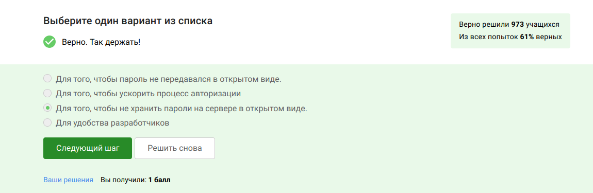

---
## Front matter
lang: ru-RU
title: "Внешний курс. Основы Кибербезопасности"
author:
  - Воробьев Д.П.
institute:
  - Российский университет дружбы народов, Москва, Россия
## i18n babel
babel-lang: russian
babel-otherlangs: english

## Fonts
mainfont: IBM Plex Serif
romanfont: IBM Plex Serif
sansfont: IBM Plex Sans
monofont: IBM Plex Mono
mathfont: STIX Two Math
mainfontoptions: Ligatures=Common,Ligatures=TeX,Scale=0.94
romanfontoptions: Ligatures=Common,Ligatures=TeX,Scale=0.94
sansfontoptions: Ligatures=Common,Ligatures=TeX,Scale=MatchLowercase,Scale=0.94
monofontoptions: Scale=MatchLowercase,Scale=0.94,FakeStretch=0.9
mathfontoptions:

## Formatting pdf
toc: false
toc-title: Содержание
slide_level: 2
aspectratio: 169
section-titles: true
theme: metropolis
header-includes:
 - \metroset{progressbar=frametitle,sectionpage=progressbar,numbering=fraction}
 - '\makeatletter'
 - '\beamer@ignorenonframefalse'
 - '\makeatother'
 
---

# Информация

## Докладчик

:::::::::::::: {.columns align=center}
::: {.column width="70%"}

  * Воробьев Данил Павлович
  * Студент группы НБИ 02-23
  * Российский университет дружбы народов
:::
::::::::::::::

## Преподаватель

:::::::::::::: {.columns align=center}
::: {.column width="70%"}

  * Кулябов Дмитрий Сергеевич
  * д.ф.-м.н., профессор
  * профессор кафедры прикладной информатики и теории вероятностей
  * Российский университет дружбы народов
:::
::::::::::::::

# Блок 1

# Вводная часть

## Цели и задачи

Выполнить контрольные задания первого блока "Безопасность в сети" внешнего курса "Основы кибербезопасности".

## Материалы и методы

Интернет-ресурсы

# Основная часть 

## Как работает интернет: базовые сетевые протоколы Вопрос 2.1.1 

Протокол HTTP(S) протокол прикладного уровня, ответ на вопрос 1 - HTTPS

## Вопрос 2.1.2

На транспортном уровне существует два примера протокола: первый - это TCP, в честь которого названа модель.

## Вопрос 2.1.3

Т.к адрес состоит из большего набора чисел, а именно это 4 или 6 цифер от 0 до 255. В двух вариантах встречаются цифры больше 255, что неверно

## Вопрос 2.1.4

Основная задача DNC это сопоставлять название ( доменное имя, с корекстым IP-адресом) с тем, где лежит этот сервер, этот сайт

## [Вопрос 2.1.5

Классификация протоколов в модели TCP/IP:

- Прикладной уровень: HTTP, RTSP, FTP, DNS.

- Транспортный уровень: TCP, UDP, SCTP, DCCP.

- Сетевой  уровень: IP.

- Уровень сетевого доступа (Канальный) (Link Layer): Ethernet, IEEE 802.11, WLAN, SLIP, Token Ring, ATM и MPLS

## Вопрос 2.1.6

Протокол http передает не зашифрованные данные, а протокол https уже будет передавать зашифрованные данные

## Вопрос 2.1.7

https передает зашифрованные данные, поэтому одна из фаз это передача данных, другая должна быть рукопожатием

## Вопрос 2.1.8

TLS определяется клиентом и сервером, чтобы возможно было подключиться

##  Вопрос 2.1.9

Фаза рукопожатия вкючает в себя: 

- выбор параметров, протоколов
- аутентификация (как минимум, сервера)
- формируется общий секретный ключ K 

Следовательно вариант с шифрованием лишний

## Персонализация сети Вопрос 2.2.1

Куки хранят в себе список параметров и их значений. Этими параметрами могут быть id пользователя, id сессии, тип браузера и некоторые действия пользователей 

## Вопрос 2.2.2

Куки не делают соединение надежным

## Вопрос 2.2.3

Куки генерируются сервером

## Вопрос 2.2.4

Куки бывают сессионные, удаляются при закрытии окна браузера

## Браузер TOR. Анонимизация Вопрос 2.3.1

В луковой модели маршрутизации у нас тоже есть узлы. Они разделяются на охранный узел, промежуточный и выходной. В браузере Tor всегда есть три роутера, их не больше и не меньше

##  Вопрос 2.3.2

IP-адрес не должен быть известен охранному и промежуточному узлам

##  Вопрос 2.3.3

В анонимных сетях, таких как Tor, общий секретный ключ для сквозного шифрования требует участия всех трех типов узлов: охранного, промежуточного и выходного. Охранный узел сам по себе не обеспечивает генерацию ключа. Каждый узел вносит свой вклад в криптографический протокол (например, Diffie-Hellman), обеспечивая анонимность и защиту от перехвата.

##  Вопрос 2.3.4

Для получения пакетов не нужно использовать TOR. TOR — это технология, которая позволяет с некоторым успехом скрыть личность человека в интернете

## Беспроводные сети Wi-fi Вопрос 2.4.1

WiFi - это технология беспроводной локальной сети, она основана на стандарте IEEE 802.11

## Вопрос 2.4.1

WiFi работает на самом нижнем канальном уровне

## Вопрос 2.4.1

WEP - устаревший и небезопасный метод шифрования WiFi из-за короткой длины ключа (40 бит), что делает его легко взламываемым. Использовать WEP категорически не рекомендуется

## Вопрос 2.4.1

Безопасность WiFi подразумевает защиту передачи данных между устройством (телефон, компьютер) и роутером (подключенным к интернету), осуществляемую с помощью шифрования и аутентификации

## Вопрос 2.4.1

WPA2 Personal предназначен для домашнего использования, а WPA2 Enterprise - для коммерческих организаций.

# Вывод

При выполнении блока "Безопасность в сети" выясненено, как работают сетевые пратаколы, куки-файлы, сети вайфай и для чего нужен браузер Tor.

# Блок 2

# Вводная часть

## Цели и задачи

Выполнить контрольные задания второго блока "Защита ПК/телефона" внешнего курса "Основы кибербезопасности".

## Материалы и методы

Интернет-ресурсы

# Основная часть 

## Шифрование диска Вопрос 3.1.1

Шифровать нужно не только жесткий диск, но и загрузочный сектор диска. Ответ-можно

## Вопрос 3.1.2

Шифрование диска основано на симметричном шифровании

## Вопрос 3.1.3

Популярные ОС имеют встроенные инструменты для шифрования дисков: Windows (Bitlocker), Linux (LUKS), MacOS (FileVault). Также доступны бесплатные опенсорсные альтернативы, такие как Veracrypt и PGPDisk.

## Вопрос 3.2.1 Пароли

Стойкий пароль содержит цифры стройчные и заглавные буквы и специальные символы. Это усложняет перебор пароля

## [Вопрос 3.2.2

Безопасно хранить пароли нужно только в месенджерах 

## Вопрос 3.2.3

Капча - тест для определения, кто общается с веб-сервисом, человек или бот

## Вопрос 3.2.4

В целях безопасности пароли хранят не в открвтом виде, а в виде хешей

## Вопрос 3.2.5

Соль - это метод защиты слабых паролей. Сервер добавляет соль к паролю пользователя. Это делает взлом слабых паролей сложнее 

##  Вопрос 3.2.6

Для безопасности нужно использовать длинные, сложные пароли, регулярно обновлять и хранить пароли в месенджерах паролей.

## Фишинг Вопрос 3.3.1

Пример фишинга - эта маскировка под известные веб-сайты только с другим доменным именем

## Вопрос 3.3.2

Может фишинговое письмо прийти и от знакомого

##  Вирусы Вопрос 3.4.1

Спуфинг - это подмена адреса отправителя в имейлах

## Вопрос 3.4.2

Троян маскируется под обыкновенную безобидную программу, при запуске которой вирус легко проникает в ваш компьютер и поражает его

## Безопасность мессенджеров Вопрос 3.5.1

При генерации первого сообщения отправителем формируется ключ шифрования

## Вопрос 3.5.2

Сквозное шифрование позволяет передавать сообщения между пользователями (Алиса и Боб) так, что сервер знает только адресата, но не может прочитать содержимое. Алиса шифрует сообщение, сервер передает шифрованный текст Бобу, а Боб его расшифровывает. Сервер не имеет доступа к ключам или открытому тексту сообщения.

## Вывод

Второй блок курса "Основы кибербезопасности" дал понять правила составления и хранения паролей, понял много нового о вирусах и мерах безопасности против них.

# Блок 3

# Вводная часть

## Цели и задачи

Выполнить контрольные задания третьего блока "Криптография на практи" внешнего курса "Основы кибербезопасности".

## Материалы и методы

Интернет-ресурсы, Информация с лекций курса.

# Основная часть 

## Выполнение заданий блока "Основы Кибербезопасности"

В асимметричной криптографии у каждой из старон есть пара ключей: открытый и секретный ключ

## Выполнение заданий блока "Основы Кибербезопасности"

Криптографическая хэш-функция обладает важным свойством стойкости к коллизиям, что означает, что крайне сложно найти два разных входа, которые дают одинаковый хэш. Она принимает произвольный объем данных и выдает фиксированную строку заданной длины (например, n). Обычно функция сжимает данные, преобразуя большой набор информации в небольшое значение

## Выполнение заданий блока "Основы Кибербезопасности"

Отмечены алгоритмы цифровой подписи

## Выполнение заданий блока "Основы Кибербезопасности"

Код аутентификации сообщения (MAC) относится к симметричным примитивам, поскольку для его генерации и проверки используется общий секретный ключ, известный только отправителю и получателю, что обеспечивает целостность и аутентичность данных

## Выполнение заданий блока "Основы Кибербезопасности"

Чтобы ответить на данный вопрос использую определение Диффи-Хэллмана

## Выполнение заданий блока  Цифровая подпись

По определению цифровой подписи протокол ЭЦП относиться к протоколам с публичным ключом

## Выполнение заданий блока  Цифровая подпись

Каждая машина процедуру верификации, которая берет на вход само обновление, подпись и открытый ключ разработчика

## Выполнение заданий блока  Цифровая подпись

Цифровая подпись обеспечивает три ключевых функции: 

1. Целостность сообщения — изменения в сообщении приводят к некорректной проверке подписи.

2. Аутентификация — позволяет установить, что подпись принадлежит конкретному владельцу.

3. Неотказ от авторства — подписавший не может отказаться от своей подписи.

Однако, если секретный ключ украден, безопасность подписи подрывается, и она не обеспечивает конфиденциальности

##  Выполнение заданий блока  Цифровая подпись

Усиленная квалифицированная подпись (УКЭП) имеет юридическую силу и равнозначна рукописной подписи. Для её получения необходимо обратиться в аккредитованный сертификационный центр с паспортом и другими данными.

## Выполнение заданий блока  Цифровая подпись

Сертификат подписывается с помощью электронной подписи уже доверенной стороной, удостоверяющим центром.

## Выполнение заданий блока Электронные платежи

На данный момент существуют такие платежные системы, как: Visa, MasterCard, МИР

## Выполнение заданий блока Электронные платежи

Основные категории вещей, которые мы можем использовать для доказательства своей идентичности:

1. Знание: Это что-то, что я знаю, например, пароль, PIN-код или секретный код для онлайн-платежей.

   
2. Владение: В онлайн-платежах используется второй фактор — это то, чем я владею, например, телефон, на который приходит код для подтверждения.
 
 
3. Свойства: Биометрические данные, такие как отпечаток пальца или сетчатка глаза, служат третьим фактором аутентификации.

4. Локация: Четвертый фактор аутентификации — это место, откуда осуществляется доступ, что также может быть учтено при проверке идентичности.

## Выполнение заданий блока Блокчейн

Proof-of-Work (PoW) — это способ, который используется в блокчейне для подтверждения транзакций и создания новых блоков. В этом процессе майнеры (люди, которые занимаются добычей криптовалюты) соревнуются друг с другом за завершение транзакций в сети и за вознаграждение

Когда люди отправляют друг другу цифровые деньги, эти транзакции собираются в блоки и добавляются в общую базу данных, называемую блокчейном. Чтобы сделать сеть безопасной и защитить её от мошенничества, PoW требует много вычислительных ресурсов. Это значит, что для успешного участия в процессе нужно много мощных компьютеров

## Выполнение заданий блока Блокчейн

В основе любого блокчейна, включая биткоин, лежит консенсус — публичная структура данных (ledger), содержащая историю всех транзакций. Консенсус обеспечивает четыре ключевых свойства:

1. Постоянство: Добавленные данные не могут быть удалены.

2. Согласованность: Все участники видят и согласны с одними и теми же данными, за исключением последних изменений.

3. Живучесть: Возможность добавления новых транзакций в любое время.

4. Открытость: Любой желающий может стать участником блокчейна.

Эти свойства обеспечивают надежность и безопасность системы.

## Выполнение заданий блока Блокчейн

В блокчейне у каждого из трех участников есть секретный ключ, который они используют для подтверждения транзакций. Этот секретный ключ позволяет создавать цифровую подпись, которая служит доказательством того, что транзакция была инициирована конкретным участником. Цифровая подпись основана на паре ключей — секретном и открытом. Секретный ключ используется для подписания транзакции, а открытый ключ позволяет другим участникам проверить подлинность этой подписи. Таким образом, цифровая подпись обеспечивает безопасность и аутентичность транзакций в блокчейне.

## Вывод

В результате 3 этапа я узнал много нового о криптографии, цифровых подписях и технологиях бкокчейна. Выяснил как обеспечивается безопасность транзакций. 

# Общий вывод

В результате выполнения внешнего курса я узнал как работают сетевые пратаколы, куки-файлы, сети вайфай и для чего нужен браузер Tor.
:::

