---
## Front matter
title: "Внешний курс"
subtitle: "Степик по основам безопасности"
author: "Воробьев Данил Павлович"

## Generic otions
lang: ru-RU
toc-title: "Содержание"

## Bibliography
bibliography: bib/cite.bib
csl: pandoc/csl/gost-r-7-0-5-2008-numeric.csl

## Pdf output format
toc: true # Table of contents
toc-depth: 2
lof: true # List of figures
lot: true # List of tables
fontsize: 12pt
linestretch: 1.5
papersize: a4
documentclass: scrreprt
## I18n polyglossia
polyglossia-lang:
  name: russian
  options:
	- spelling=modern
	- babelshorthands=true
polyglossia-otherlangs:
  name: english
## I18n babel
babel-lang: russian
babel-otherlangs: english
## Fonts
mainfont: IBM Plex Serif
romanfont: IBM Plex Serif
sansfont: IBM Plex Sans
monofont: IBM Plex Mono
mathfont: STIX Two Math
mainfontoptions: Ligatures=Common,Ligatures=TeX,Scale=0.94
romanfontoptions: Ligatures=Common,Ligatures=TeX,Scale=0.94
sansfontoptions: Ligatures=Common,Ligatures=TeX,Scale=MatchLowercase,Scale=0.94
monofontoptions: Scale=MatchLowercase,Scale=0.94,FakeStretch=0.9
mathfontoptions:
## Biblatex
biblatex: true
biblio-style: "gost-numeric"
biblatexoptions:
  - parentracker=true
  - backend=biber
  - hyperref=auto
  - language=auto
  - autolang=other*
  - citestyle=gost-numeric
## Pandoc-crossref LaTeX customization
figureTitle: "Рис."
tableTitle: "Таблица"
listingTitle: "Листинг"
lofTitle: "Список иллюстраций"
lotTitle: "Список таблиц"
lolTitle: "Листинги"
## Misc options
indent: true
header-includes:
  - \usepackage{indentfirst}
  - \usepackage{float} # keep figures where there are in the text
  - \floatplacement{figure}{H} # keep figures where there are in the text
---  
  
# Блок 1

# Цель работы
 
Выполнить контрольные задания первого блока "Безопасность в сети" внешнего курса "Основы кибербезопасности".

# Выполнение заданий блока "Основы Кибербезопасности"

## Как работает интернет: базовые сетевые протоколы

Протокол HTTP(S) протокол прикладного уровня, ответ на вопрос 1 - HTTPS (рис. [-@fig:001]).

{#fig:001 width=70%}

На транспортном уровне существует два примера протокола: первый - это TCP, в честь которого названа модель. (рис. [-@fig:002]).

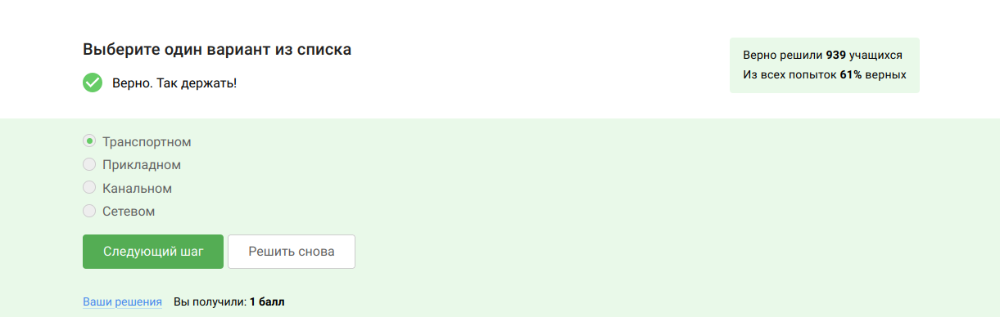{#fig:002 width=70%}

Т.к адрес состоит из большего набора чисел, а именно это 4 или 6 цифер от 0 до 255. В двух вариантах встречаются цифры больше 255, что неверно(рис. [-@fig:003]).

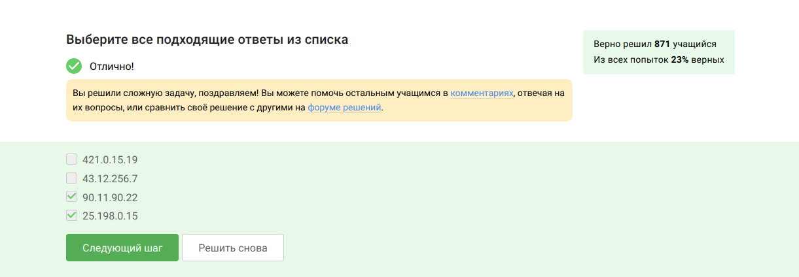{#fig:003 width=70%}

Основная задача DNC это сопоставлять название ( доменное имя, с корекстым IP-адресом) с тем, где лежит этот сервер, этот сайт. (рис. [-@fig:004]).

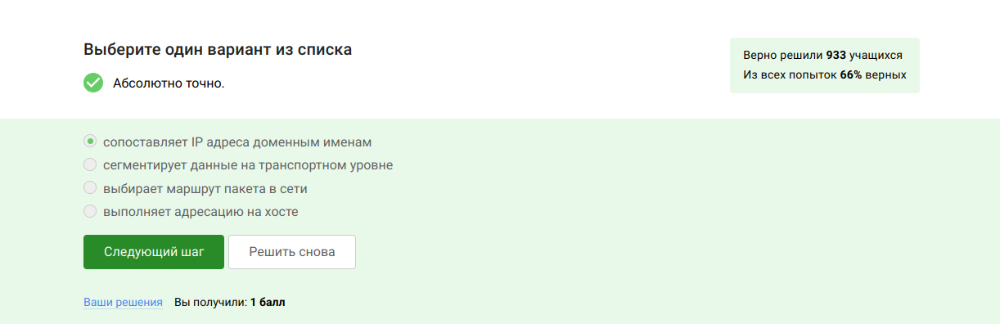{#fig:004 width=70%}

Классификация протоколов в модели TCP/IP:

- Прикладной уровень: HTTP, RTSP, FTP, DNS.

- Транспортный уровень: TCP, UDP, SCTP, DCCP.

- Сетевой  уровень: IP.

- Уровень сетевого доступа (Канальный) (Link Layer): Ethernet, IEEE 802.11, WLAN, SLIP, Token Ring, ATM и MPLS(рис. [-@fig:005]).

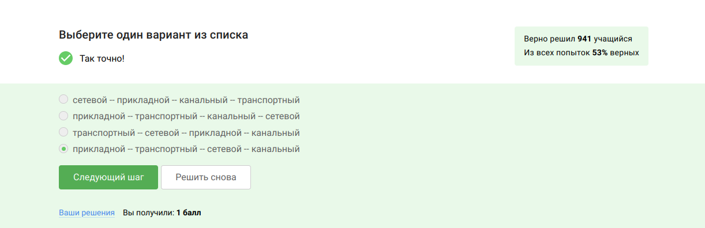{#fig:005 width=70%}

Протокол http передает не зашифрованные данные, а протокол https уже будет передавать зашифрованные данные (рис. [-@fig:006]).

 https передает зашифрованные данные, поэтому  одна из фаз это передача данных, другая должна быть рукопожатием
 
 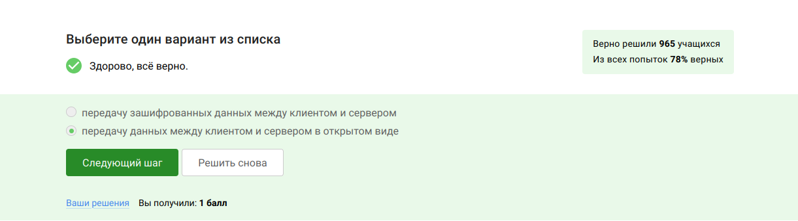{#fig:006 width=70%}

TLS определяется и клиентом, и сервером, чтобы было возможно подключиться (рис. [-@fig:007]).

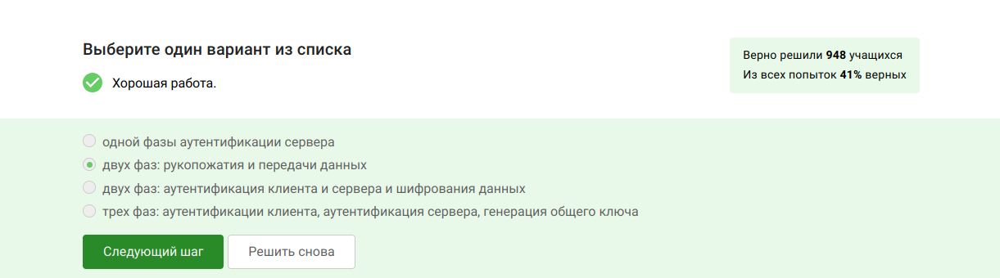{#fig:007 width=70%}

TLS определяется клиентом и сервером, чтобы возможно было подключиться (рис. [-@fig:008]).

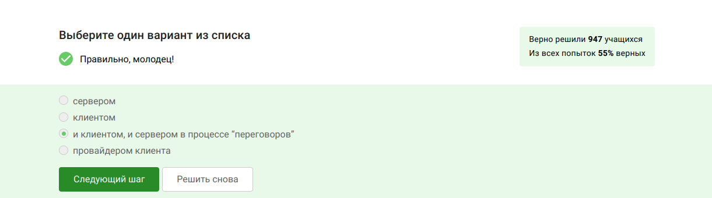{#fig:008 width=70%}

Фаза рукопожатия вкючает в себя: 

- выбор параметров, протоколов
- аутентификация (как минимум, сервера)
- формируется общий секретный ключ K 

Следовательно вариант с шифрованием лишний (рис. [-@fig:009]).

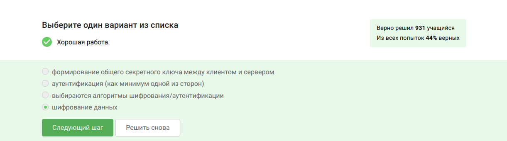{#fig:009 width=70%}

## Персонализация сети

Куки хранят в себе список параметров и их значений. Этими параметрами могут быть id пользователя, id сессии, тип браузера и некоторые действия пользователей(рис. [-@fig:010]).

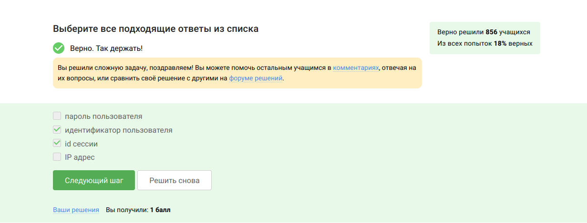{#fig:010 width=70%}

Куки не делают соединение надежным (рис. [-@fig:011]).

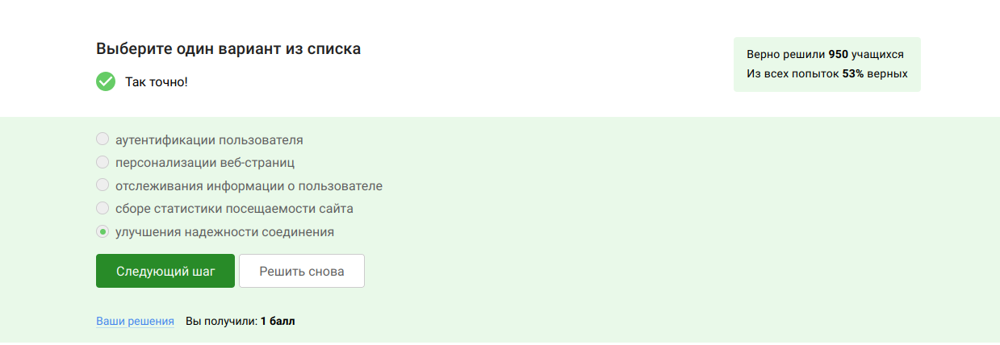{#fig:011 width=70%}

Куки генерируются сервером(рис. [-@fig:012]).

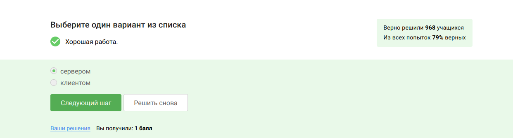{#fig:012 width=70%}

Куки бывают сессионные, удаляются при закрытии окна браузера (рис. [-@fig:013]).

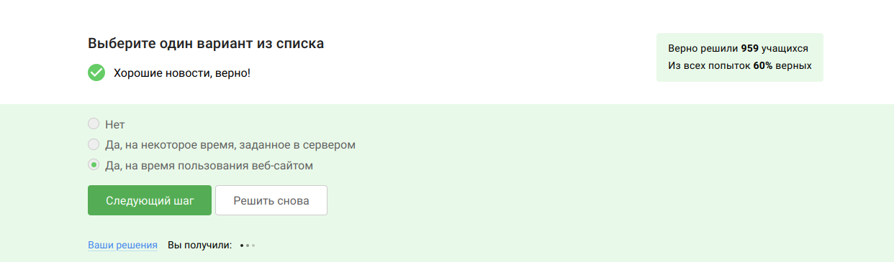{#fig:013 width=70%}

## Браузер TOR. Анонимизация

В луковой модели маршрутизации у нас тоже есть узлы. Они разделяются на охранный узел, промежуточный и выходной. В браузере Tor всегда есть три роутера, их не больше и не меньше (рис. [-@fig:014]).

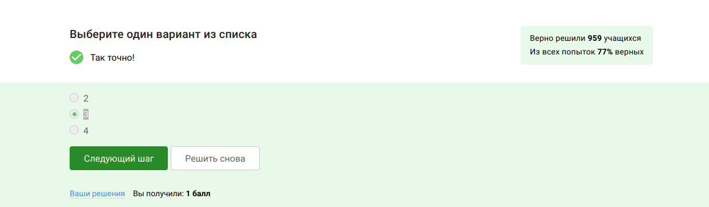{#fig:014 width=70%}

IP-адрес не должен быть известен охранному и промежуточному узлам (рис. [-@fig:015]).

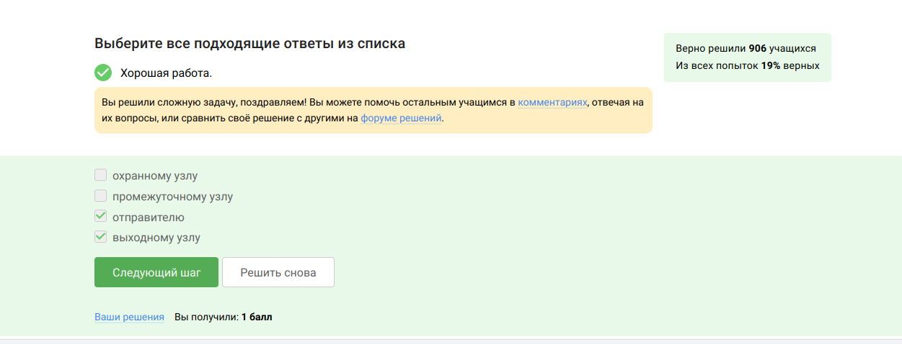{#fig:015 width=70%}

В анонимных сетях, таких как Tor, общий секретный ключ для сквозного шифрования требует участия всех трех типов узлов: охранного, промежуточного и выходного. Охранный узел сам по себе не обеспечивает генерацию ключа. Каждый узел вносит свой вклад в криптографический протокол (например, Diffie-Hellman), обеспечивая анонимность и защиту от перехвата. (рис. [-@fig:016]).

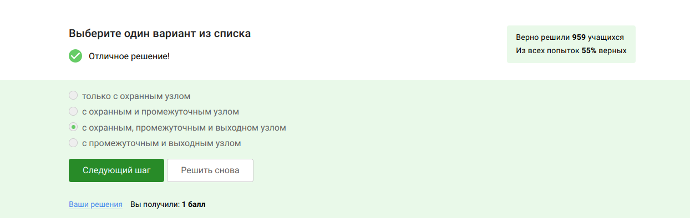{#fig:016 width=70%}

Для получения пакетов не нужно использовать TOR. TOR — это технология, которая позволяет с некоторым успехом скрыть личность человека в интернете.(рис. [-@fig:017]).

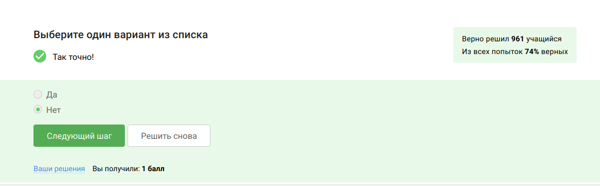{#fig:017 width=70%}

## Беспроводные сети Wi-fi

WiFi - это технология беспроводной локальной сети, она основана на стандарте IEEE 802.11 (рис. [-@fig:018]).

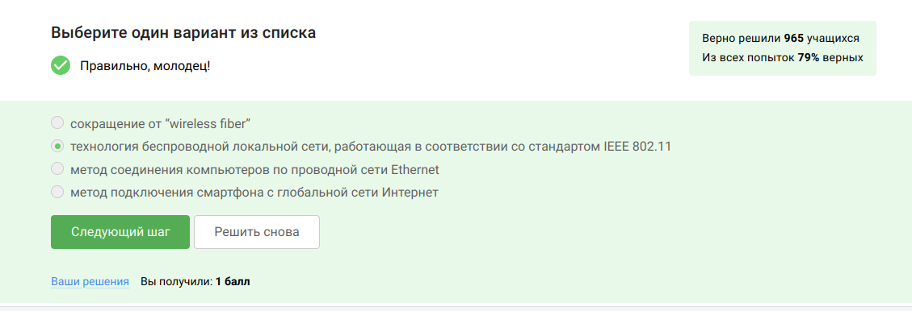{#fig:018 width=70%}

WiFi работает на самом нижнем канальном уровне (рис. [-@fig:019]).

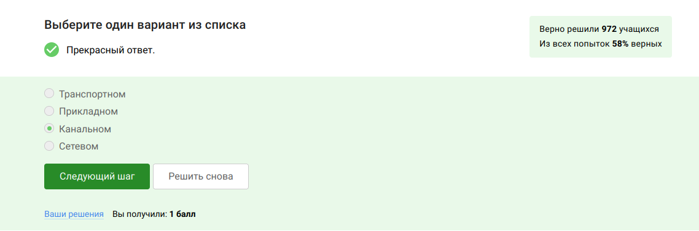{#fig:019 width=70%}

WEP - устаревший и небезопасный метод шифрования WiFi из-за короткой длины ключа (40 бит), что делает его легко взламываемым. Использовать WEP категорически не рекомендуется.(рис. [-@fig:020]).

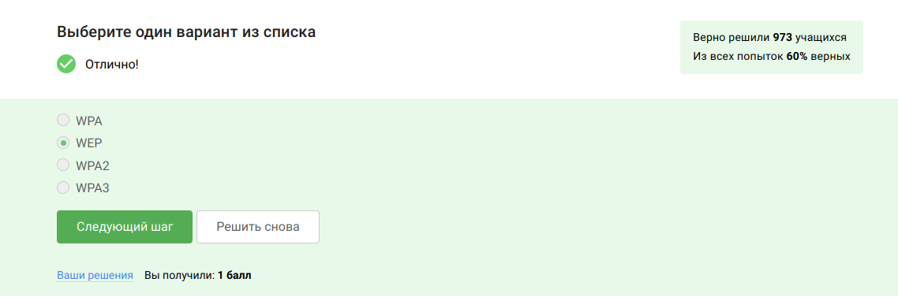{#fig:020 width=70%}

Безопасность WiFi подразумевает защиту передачи данных между устройством (телефон, компьютер) и роутером (подключенным к интернету), осуществляемую с помощью шифрования и аутентификации.(рис. [-@fig:021]).

{#fig:021 width=70%}

WPA2 Personal предназначен для домашнего использования, а WPA2 Enterprise - для коммерческих организаций. (рис. [-@fig:022]).

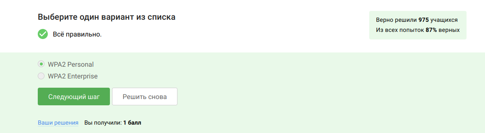{#fig:022 width=70%}

# Блок 2

# Цель работы
 
Выполнить контрольные задания второго блока "Защита ПК/телефона" внешнего курса "Основы кибербезопасности".

# Выполнение заданий блока "Основы Кибербезопасности"

## Шифрование диска

Шифровать нужно не только жесткий диск, но и загрузочный сектор диска. Ответ-можно (рис. [-@fig:023]).

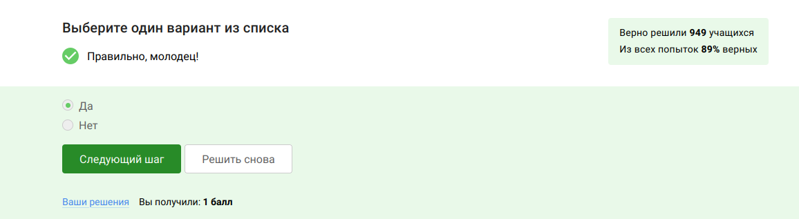{#fig:023 width=70%}

Шифрование диска основано на симметричном шифровании (рис. [-@fig:024]).

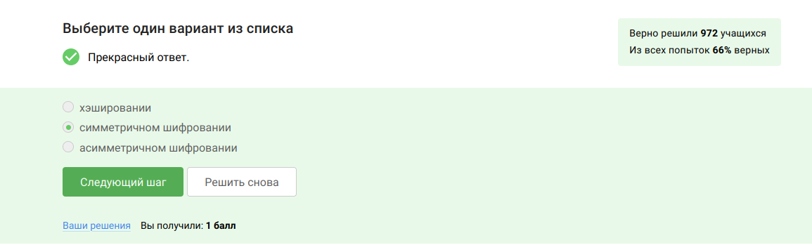{#fig:024 width=70%}

Популярные ОС имеют встроенные инструменты для шифрования дисков: Windows (Bitlocker), Linux (LUKS), MacOS (FileVault). Также доступны бесплатные опенсорсные альтернативы, такие как Veracrypt и PGPDisk. (рис. [-@fig:025]).

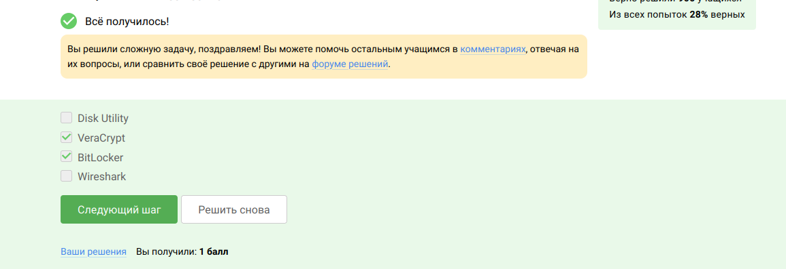{#fig:025 width=70%}

## Пароли

Стойкий пароль содержит цифры стройчные и заглавные буквы и специальные символы. Это усложняет перебор пароля (рис. [-@fig:026]).

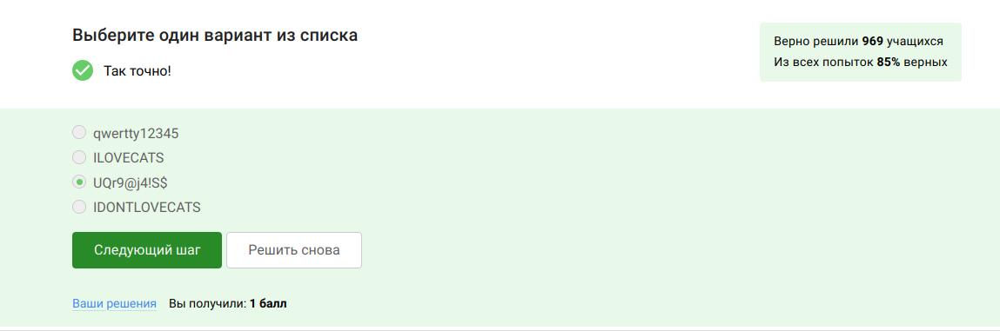{#fig:026 width=70%}

Безопасно хранить пароли нужно только в месенджерах  (рис. [-@fig:027]).

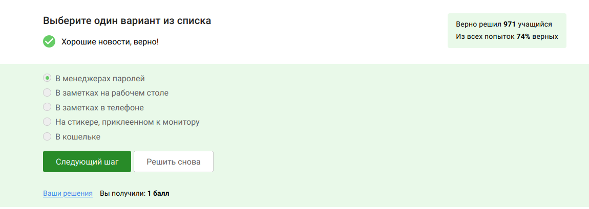{#fig:027 width=70%}

Капча - тест для определения, кто общается с веб-сервисом, человек или бот(рис. [-@fig:028]).

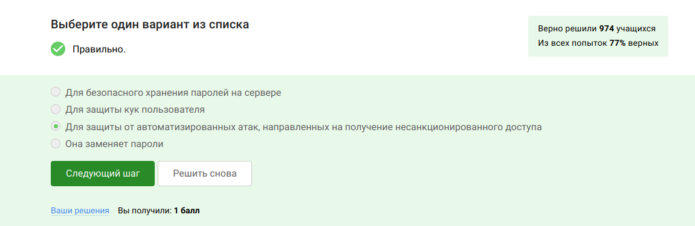{#fig:028 width=70%}

В целях безопасности пароли хранят не в открвтом виде, а в виде хешей (рис. [-@fig:029]).

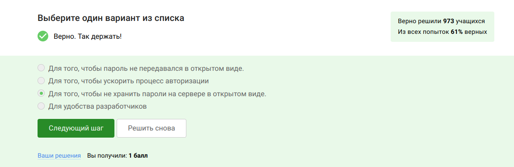{#fig:029 width=70%}

Соль - это метод защиты слабых паролей. Сервер добавляет соль к паролю пользователя. Это делает взлом слабых паролей сложнее (рис. [-@fig:030]).

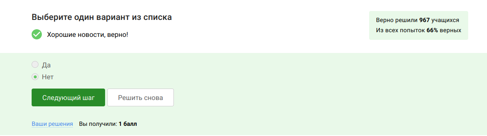{#fig:030 width=70%}

Для безопасности нужно использовать длинные, сложные пароли, регулярно обновлять и хранить пароли в месенджерах паролей. (рис. [-@fig:031]).

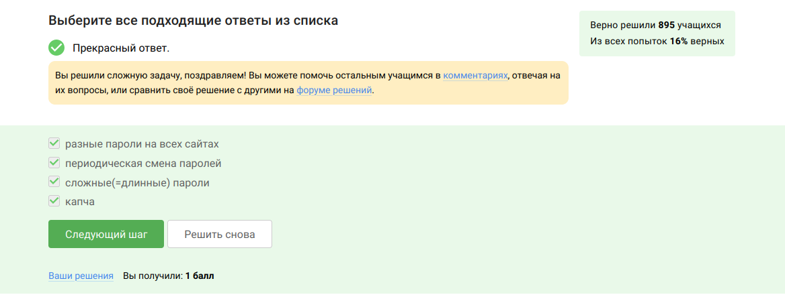{#fig:031 width=70%}

##  Фишинг

Пример фишинга - эта маскировка под известные веб-сайты только с другим доменным именем (рис. [-@fig:032]).

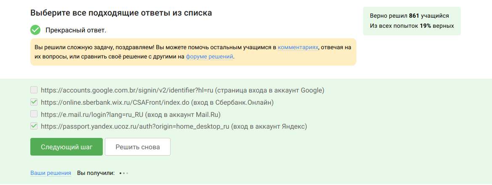{#fig:032 width=70%}

Может фишинговое письмо прийти и от знакомого(рис. [-@fig:033]).

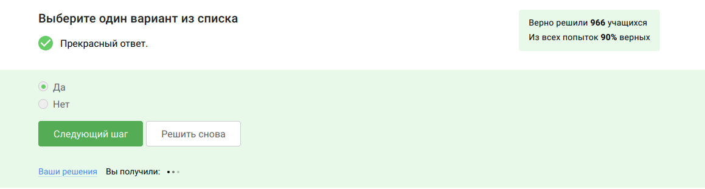{#fig:033 width=70%}

## Вирусы. 

Спуфинг - это подмена адреса отправителя в имейлах (рис. [-@fig:034]).

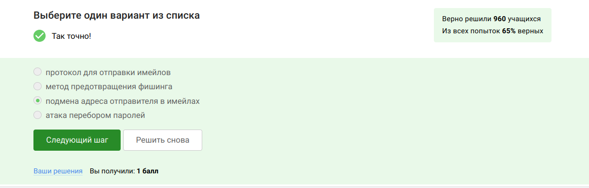{#fig:034 width=70%}

 Троян маскируется под обыкновенную безобидную программу, при запуске которой вирус легко проникает в ваш компьютер и поражает его(рис. [-@fig:035]).

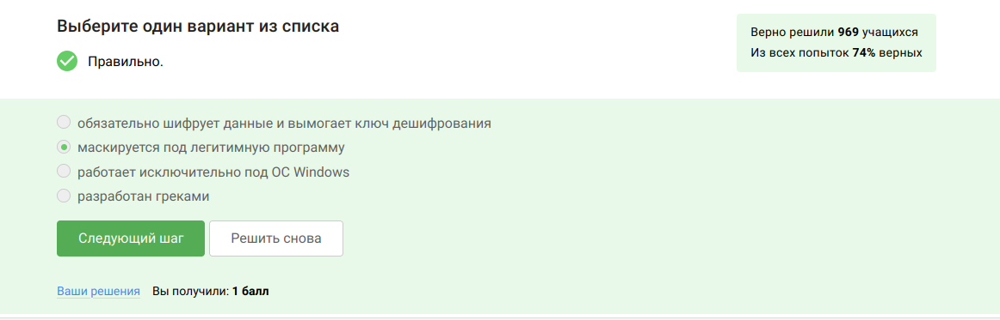{#fig:035 width=70%}

## Безопасность мессенджеров

При генерации первого сообщения отправителем формируется ключ шифрования (рис. [-@fig:036]).

{#fig:036 width=70%}

Сквозное шифрование позволяет передавать сообщения между пользователями (Алиса и Боб) так, что сервер знает только адресата, но не может прочитать содержимое. Алиса шифрует сообщение, сервер передает шифрованный текст Бобу, а Боб его расшифровывает. Сервер не имеет доступа к ключам или открытому тексту сообщения. (рис. [-@fig:037]).

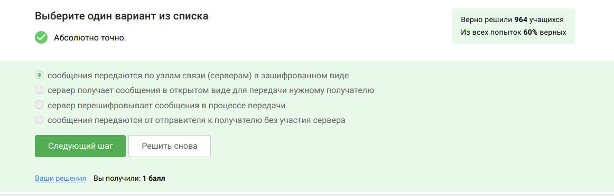{#fig:037 width=70%}

# Выводы

В результате я сделал второй блок курса "Основы кибербезопасности". Узнал правила составления и хранения паролей, понял много нового о вирусах и мерах безопасности против них.

# Блок 3 

# Цель работы
 
Выполнить контрольные задания третьего блока "Криптография на практи" внешнего курса "Основы кибербезопасности".

# Выполнение заданий блока "Основы Кибербезопасности"

## Введение в криптографию

В асимметричной криптографии у каждой из старон есть пара ключей: открытый и секретный ключ (рис. [-@fig:038]).

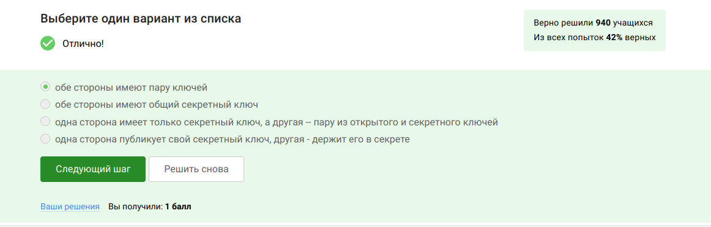{#fig:038 width=70%}

Криптографическая хэш-функция обладает важным свойством стойкости к коллизиям, что означает, что крайне сложно найти два разных входа, которые дают одинаковый хэш. Она принимает произвольный объем данных и выдает фиксированную строку заданной длины (например, n). Обычно функция сжимает данные, преобразуя большой набор информации в небольшое значение. (рис. [-@fig:039]).

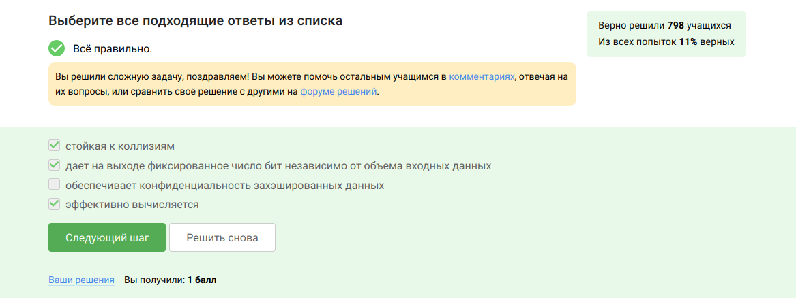{#fig:039 width=70%}

Отмечены алгоритмы цифровой подписи (рис. [-@fig:040]).

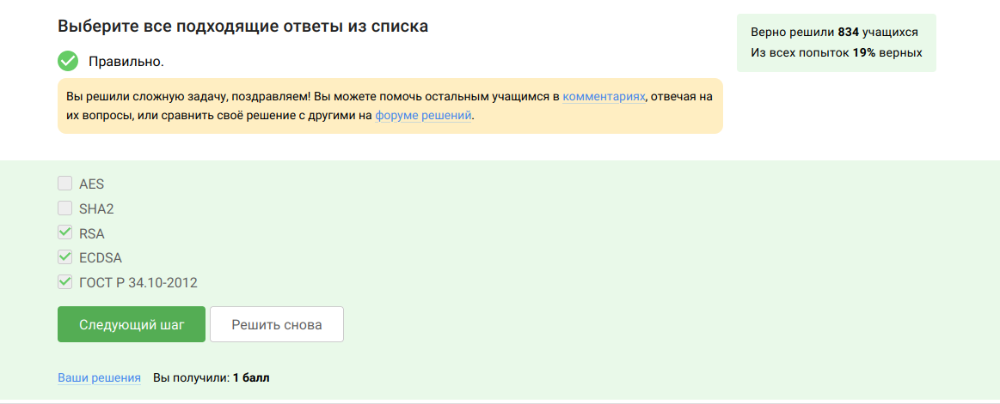{#fig:040 width=70%}

Код аутентификации сообщения (MAC) относится к симметричным примитивам, поскольку для его генерации и проверки используется общий секретный ключ, известный только отправителю и получателю, что обеспечивает целостность и аутентичность данных.(рис. [-@fig:041]).

{#fig:041 width=70%}

Чтобы ответить на данный вопрос использую определение Диффи-Хэллмана (рис. [-@fig:042]).

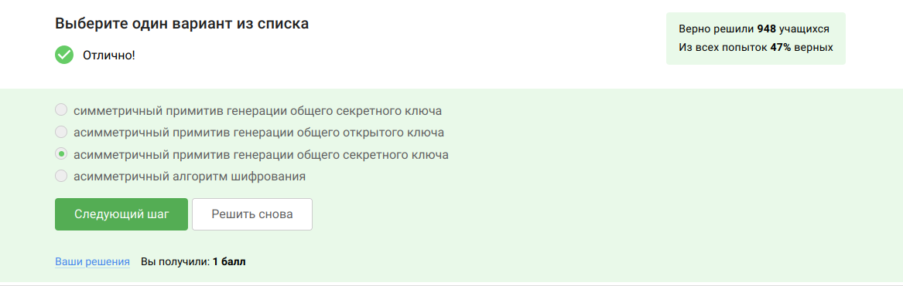{#fig:042 width=70%}

## Цифровая подпись

По определению цифровой подписи протокол ЭЦП относиться к протоколам с публичным ключом (рис. [-@fig:043]).

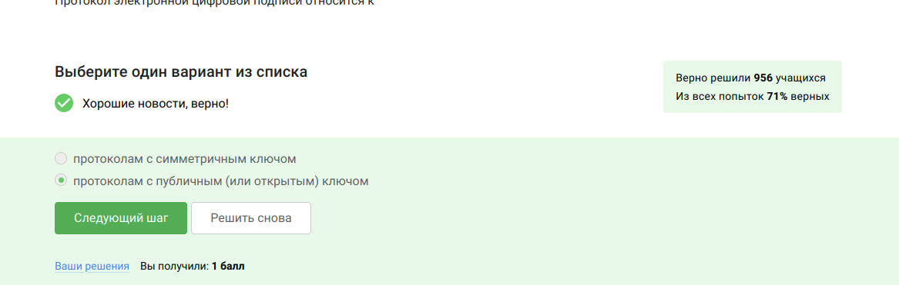{#fig:043 width=70%}

Каждая машина процедуру верификации, которая берет на вход само обновление, подпись и открытый ключ разработчика (рис. [-@fig:044]).

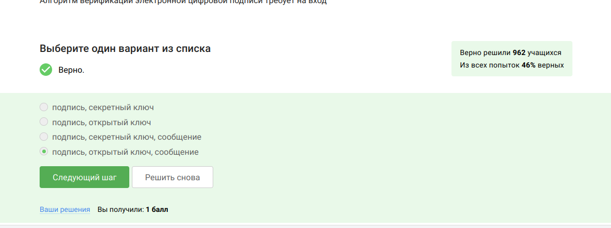{#fig:044 width=70%}

Цифровая подпись обеспечивает три ключевых функции: 

1. Целостность сообщения — изменения в сообщении приводят к некорректной проверке подписи.

2. Аутентификация — позволяет установить, что подпись принадлежит конкретному владельцу.

3. Неотказ от авторства — подписавший не может отказаться от своей подписи.

Однако, если секретный ключ украден, безопасность подписи подрывается, и она не обеспечивает конфиденциальности.(рис. [-@fig:045]).

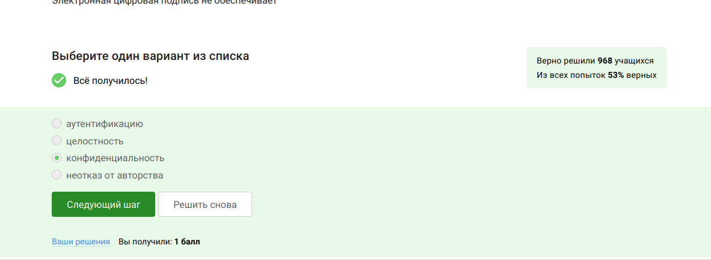{#fig:045 width=70%}

Усиленная квалифицированная подпись (УКЭП) имеет юридическую силу и равнозначна рукописной подписи. Для её получения необходимо обратиться в аккредитованный сертификационный центр с паспортом и другими данными.  (рис. [-@fig:046]).

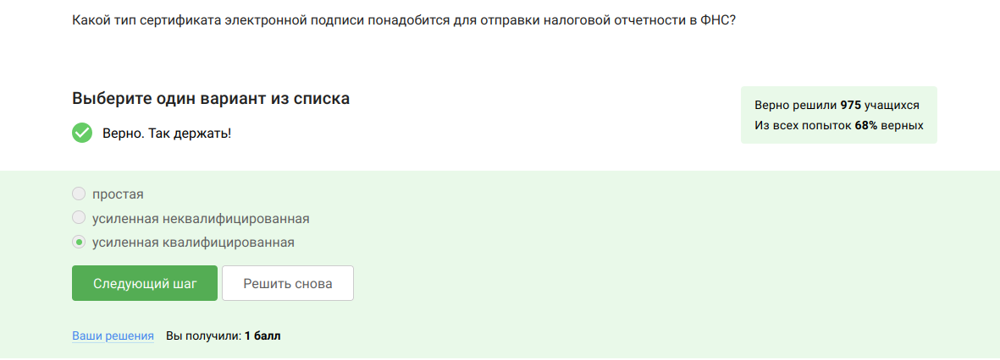{#fig:046 width=70%}

Сертификат подписывается с помощью электронной подписи уже доверенной стороной, удостоверяющим центром. (рис. [-@fig:047]).

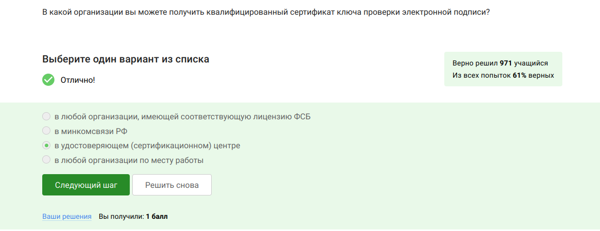{#fig:047 width=70%}

##  Электронные платежи

На данный момент существуют такие платежные системы, как: Visa, MasterCard, МИР (рис. [-@fig:048]).

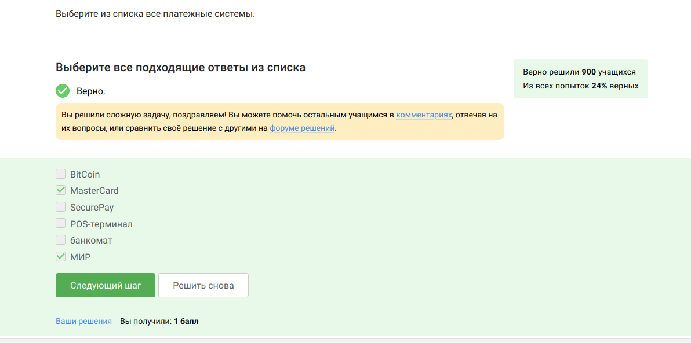{#fig:048 width=70%}

Основные категории вещей, которые мы можем использовать для доказательства своей идентичности:

1. Знание: Это что-то, что я знаю, например, пароль, PIN-код или секретный код для онлайн-платежей.

   
2. Владение: В онлайн-платежах используется второй фактор — это то, чем я владею, например, телефон, на который приходит код для подтверждения.
 
 
3. Свойства: Биометрические данные, такие как отпечаток пальца или сетчатка глаза, служат третьим фактором аутентификации.

4. Локация: Четвертый фактор аутентификации — это место, откуда осуществляется доступ, что также может быть учтено при проверке идентичности. (рис. [-@fig:049]).

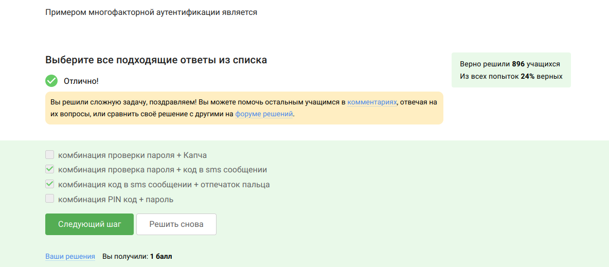{#fig:049 width=70%}

При онлайн платежах используется многофакторная аутентификация банком-эмитентом (выпустившим карту), чтобы удостовериться, что транзакцию совершает именно владелец карты или счета, а не злоумышленник(рис. [-@fig:050]).

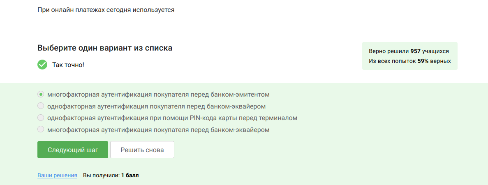{#fig:050 width=70%}

## Блокчейн

Proof-of-Work (PoW) — это способ, который используется в блокчейне для подтверждения транзакций и создания новых блоков. В этом процессе майнеры (люди, которые занимаются добычей криптовалюты) соревнуются друг с другом за завершение транзакций в сети и за вознаграждение

Когда люди отправляют друг другу цифровые деньги, эти транзакции собираются в блоки и добавляются в общую базу данных, называемую блокчейном. Чтобы сделать сеть безопасной и защитить её от мошенничества, PoW требует много вычислительных ресурсов. Это значит, что для успешного участия в процессе нужно много мощных компьютеров.(рис. [-@fig:051]).

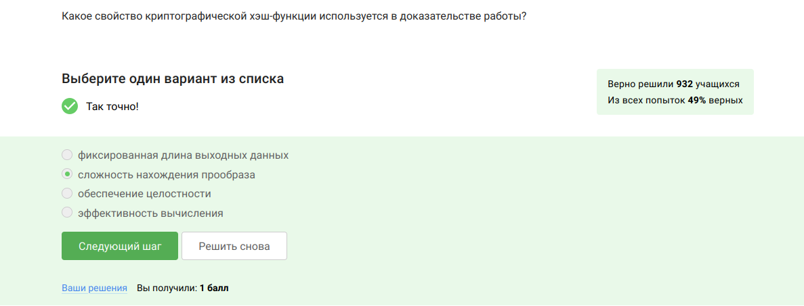{#fig:051 width=70%}

В основе любого блокчейна, включая биткоин, лежит консенсус — публичная структура данных (ledger), содержащая историю всех транзакций. Консенсус обеспечивает четыре ключевых свойства:

1. Постоянство: Добавленные данные не могут быть удалены.

2. Согласованность: Все участники видят и согласны с одними и теми же данными, за исключением последних изменений.

3. Живучесть: Возможность добавления новых транзакций в любое время.

4. Открытость: Любой желающий может стать участником блокчейна.

Эти свойства обеспечивают надежность и безопасность системы. (рис. [-@fig:052]).

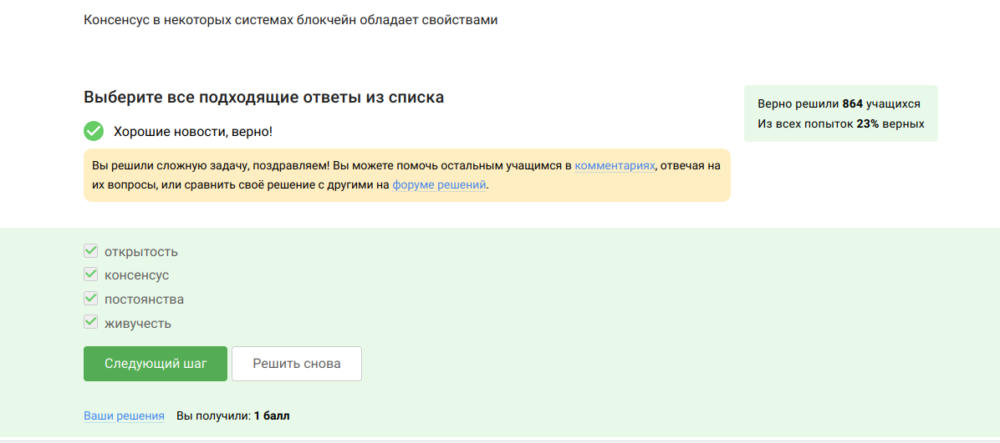{#fig:052 width=70%}

 В блокчейне у каждого из трех участников есть секретный ключ, который они используют для подтверждения транзакций. Этот секретный ключ позволяет создавать цифровую подпись, которая служит доказательством того, что транзакция была инициирована конкретным участником. Цифровая подпись основана на паре ключей — секретном и открытом. Секретный ключ используется для подписания транзакции, а открытый ключ позволяет другим участникам проверить подлинность этой подписи. Таким образом, цифровая подпись обеспечивает безопасность и аутентичность транзакций в блокчейне. (рис. [-@fig:053]).

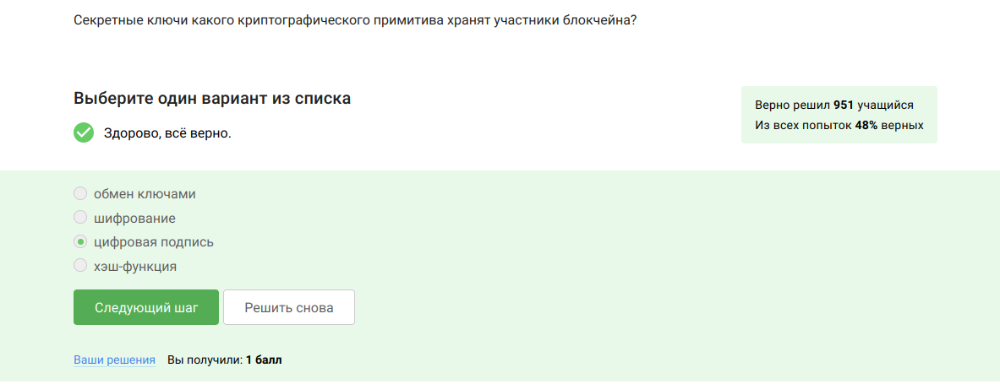{#fig:053 width=70%}

# Выводы

В результате 3 этапа я узнал много нового о криптографии, цифровых подписях и технологиях блокчейна. Выяснил как обеспечивается безопасность транзакций. 

::: {#refs}
:::

# Выводы

В результате выполнения блока "Безопасность в сети" я узнал как работают сетевые протоколы, куки-файлы, сети вайфай и для чего нужен браузер Tor.

